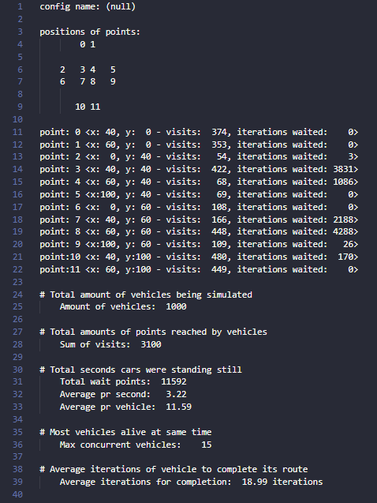

# traffic-simulation

Traffic simulation project developed by a group at AAU.

The goal of this project it to somewhat accurately simulate traffic in a specific intersection in Aalborg, with and without Plusbus implemented

## Getting Started

This program is was developed on MinGW and GNU gcc compiler.

* On Windows, download <http://www.mingw.org/>.
* On Mac, `gcc`should already be installed, or can be installed by typing `gcc` into the terminal.

To run the program, first clone the repository

```
git clone https://github.com/blitzher/traffic-simulation
```

Once downloaded, use the `make clean` rule to compile a fresh version of the binary.
This should produce a new folder, called `bin`, where the binary executable should reside.

If you wish to run the test configuration, use `make run`, which will produce a `.output` file in the main directory.
This output file, like all, will look something like



The configuration used for the `make run` rule is defined in `/traffic-simulation/.config` and can freely be modified. Each configuration is accompanied by a comment, which explains the implementation of the comment.

#### Debug
To change to debug mode, open `/include/utility.h` and change the symbolic constant `#define DEBUG 0` to `#define DEBUG 1`. This will allow for some more information to be printed to `stdout`, and whenever you add more debugging comments, they should be wrapped in `if (DEBUG) { /* print data */ }`.


## License
This project is licensed under the terms of the MIT license, see LICENSE, which means that the software can be freely used for any project, commercial and non-commercial, but with no liability or warranty from the authors.

